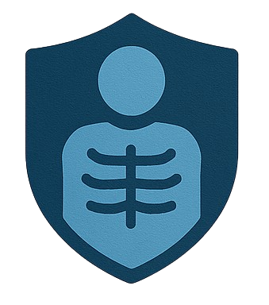

<p align="center">
  
</p>
<h1 align="center">MediSafe</h1>
 
<p align="center">
  End-to-end encrypted sharing of medical images and reports between radiologists, doctors and patients.
</p>
---
 
## Overview
 
MediSafe is a web application for exchanging sensitive medical files without the server ever seeing their contents. Files are encrypted **in the browser** before upload, and only the intended recipient can decrypt them with their own private key. The backend stores ciphertext and public keys only.
 
Three roles are supported:
 
| Role | What they can do |
|---|---|
| **Radiologist** | Encrypt and upload a medical image for a specific doctor and patient |
| **Doctor** | Decrypt and download patient images; encrypt and upload a report for a patient |
| **Patient** | Decrypt and download reports addressed to them |
 
## How it works
 
MediSafe uses a hybrid encryption scheme: AES for the files, RSA for the AES keys.
 
1. **Registration** – the browser generates an RSA-2048 key pair (Web Crypto API). The public key is sent to the server. The private key is encrypted with an AES key derived from the user's password (PBKDF2) and downloaded as a `.key` file. **The private key never reaches the server.**
2. **Radiologist → Doctor (images)** – the image is encrypted with AES-256 using a key derived from a password the radiologist chooses. That AES key is then encrypted with the doctor's RSA public key and stored next to the ciphertext.
3. **Doctor → Patient (reports)** – the same flow, using the patient's public key.
4. **Decryption** – the recipient uploads their `.key` file and password, the browser recovers the private key, decrypts the AES key, and then decrypts the file locally.
```
Sender browser                      Server                       Recipient browser
──────────────                      ──────                       ─────────────────
AES-encrypt file
RSA-encrypt AES key  ── ciphertext + wrapped key ──▶  stores  ──▶  RSA-decrypt AES key
(recipient public key)                                             AES-decrypt file
```
 
## Tech stack
 
- **Backend:** Python, [FastAPI](https://fastapi.tiangolo.com/), SQLAlchemy, SQLite
- **Frontend:** HTML, CSS and vanilla JavaScript (served by FastAPI)
- **Cryptography:** [CryptoJS](https://cryptojs.gitbook.io/docs/) (AES, PBKDF2, SHA-256), [JSEncrypt](https://github.com/travist/jsencrypt) (RSA), Web Crypto API (RSA key generation)
## Project structure
 
```
MediSafe/
├── backend/
│   ├── main.py          # FastAPI app: routes, static mounts, file storage
│   ├── models.py        # SQLAlchemy models: User, EncryptedImage, Report
│   ├── database.py      # SQLite engine and session setup
│   ├── utils.py         # File helper
│   └── auth.txt         # JWT/role-based auth module (not yet enabled)
├── frontend/
│   ├── login.html
│   ├── register.html
│   ├── radiologist/index.html     # upload encrypted image
│   ├── doctor/                    # portal, decrypt images, upload reports
│   ├── patient/index.html         # decrypt reports
│   └── assets/                    # logos
└── .gitignore
```
 
## Getting started
 
### Prerequisites
 
- Python 3.9 or later
- A modern browser (the Web Crypto API requires `localhost` or HTTPS)
### Installation
 
```bash
git clone https://github.com/<your-username>/MediSafe.git
cd MediSafe
 
python -m venv venv
source venv/bin/activate        # Windows: venv\Scripts\activate
 
pip install fastapi "uvicorn[standard]" sqlalchemy python-multipart
```
 
Create the folder used for encrypted reports (the server creates the image folder automatically, but not this one):
 
```bash
mkdir -p backend/secure_storage/encrypted_reports
```
 
### Run
 
Start the server **from the project root** so the `frontend/` and `backend/` paths resolve:
 
```bash
uvicorn backend.main:app --port 8000
```
 
Then open <http://localhost:8000>. The SQLite database (`test.db`) is created on first start.
 
> The frontend calls the API at `http://localhost:8000`, so keep the port at `8000`.
 
## Usage
 
1. **Register** an account for each role (radiologist, doctor, patient). Each registration downloads an `encryptedPrivateKey_<username>.key` file. **Keep it safe: it is the only way to decrypt your files and cannot be recovered.**
2. **Radiologist:** log in, choose an image, enter the doctor's and patient's usernames and an encryption password, then upload.
3. **Doctor:** log in, open **See Results**, enter your username, password and `.key` file, select a patient and download the decrypted image. Use **Upload Report** to send an encrypted report to a patient.
4. **Patient:** log in, enter your username, password and `.key` file, select a report and download it decrypted.
## API endpoints
 
| Method | Endpoint | Description |
|---|---|---|
| `GET` | `/`, `/register` | Login and registration pages |
| `POST` | `/register/` | Create a user and store their public key |
| `POST` | `/login` | Verify credentials and return the user's role |
| `GET` | `/users/public-key/{username}` | Fetch a user's RSA public key (PEM) |
| `POST` | `/upload-image/` | Store an encrypted image and its wrapped AES key |
| `GET` | `/get-encrypted-images/{doctor_username}` | List encrypted images addressed to a doctor |
| `POST` | `/upload_report` | Store an encrypted report and its wrapped AES key |
| `GET` | `/get-patient-reports/{patient_username}` | List encrypted reports addressed to a patient |
| `GET` | `/radiologist/`, `/doctor/`, `/patient/` | Role portals |
 
Interactive API docs are available at <http://localhost:8000/docs> while the server is running.
 
## Scope and roadmap
 
MediSafe is a proof of concept focused on the encryption workflow: confidentiality of medical files holds even if the server or its storage is compromised, because only ciphertext is stored. The following improvements would take it from prototype to deployment-ready:
 
1. **Server-side authorization** – enable the JWT and role-based dependencies already drafted in `backend/auth.txt` so every endpoint verifies the caller's identity and role. Today, login returns the role and the pages enforce navigation on the client side.
2. **Stronger password handling** – hash passwords with a salted, slow algorithm (Argon2 or bcrypt) on the server instead of a client-side SHA-256 digest, and raise the PBKDF2 iteration count for the radiologist upload to match the 100,000 used for reports.
3. **Authenticated encryption** – move from AES-CBC to AES-GCM so ciphertext integrity is verified on decryption.
4. **Deployment hardening** – serve over HTTPS, restrict CORS to the application's origin, load the API base URL and any secrets from environment variables, and move from SQLite to PostgreSQL.
5. **Operational polish** – create storage folders automatically, bundle the JavaScript libraries locally instead of loading them from CDNs, remove debug logging of key material from the browser console, and add automated tests and a `requirements.txt`.
